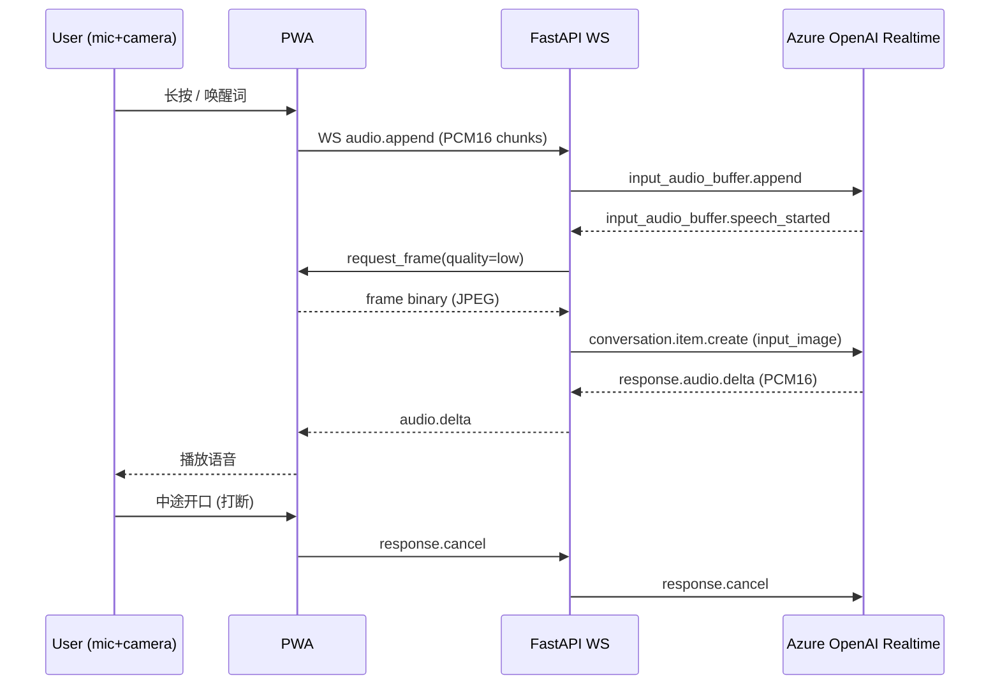

# Architecture

> Live snapshot of the deployed system. Detailed design captured in repo `plan.md`.

## Components

| Component | Tech | Notes |
| --- | --- | --- |
| PWA frontend | Vanilla JS + AudioWorklet | Hosted on Azure Static Web Apps |
| Backend | Python 3.11 + FastAPI + websockets | Containerised; Azure Container Apps |
| Model | Azure OpenAI `gpt-realtime-2` | Realtime WS API; voice in/out + native vision |
| Auth | User-Assigned Managed Identity | Container App → Azure OpenAI |
| Observability | Application Insights + OpenTelemetry | First-audio latency, interrupt count, tool calls |

## Sequence — one Q&A turn

## Trade-offs

- 单模型端到端（vision + speech in/out）→ 最低延迟，但 vision 上下文每轮新建以省 token
- 帧默认 low-res；模型主动调用 `request_high_res_frame` 才上传高清
- Container Apps min replicas=1 防冷启动；可观察 P50/P99 后调
